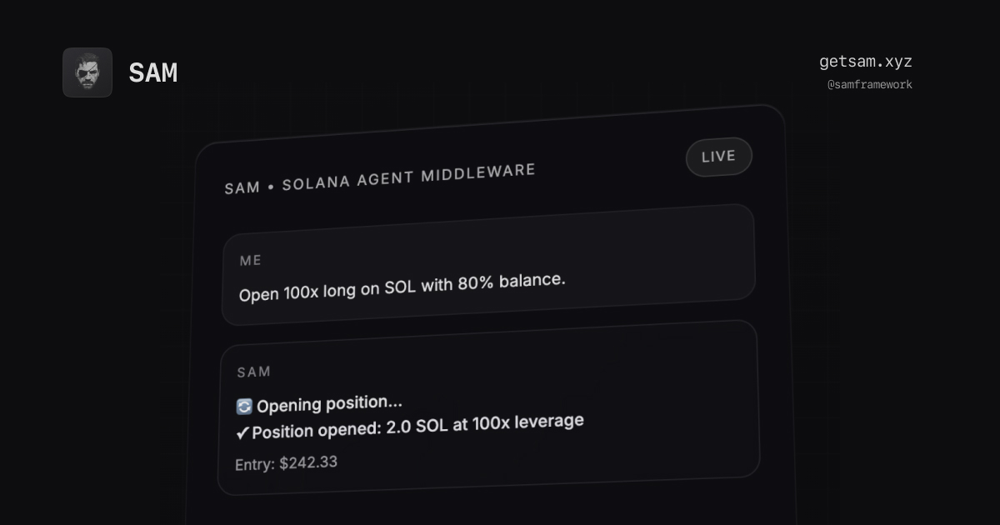

# SAM Framework

<div align="center">



**Solana Agent Middleware** - Production-ready AI agent framework for blockchain operations

[](https://www.python.org/)
[](LICENSE)
[](https://pypi.org/project/sam-framework/)
[](tests/)

Framework for building autonomous AI agents that interact with the Solana blockchain ecosystem

</div>

---

## Table of Contents

- [Overview](#overview)
- [Key Features](#key-features)
- [Quick Start](#quick-start)
- [Tool Ecosystem](#tool-ecosystem)
- [Architecture](#architecture)
- [Configuration](#configuration)
- [Plugin System](#plugin-system)
- [Security](#security)
- [Development](#development)
- [Documentation](#documentation)

---

## Overview

SAM Framework provides a production-ready infrastructure for building AI agents that interact with the Solana blockchain ecosystem. The framework implements an event-driven architecture with plugin support, enabling automated trading, portfolio management, market data analysis, and web research capabilities.

### Core Capabilities

| Category | Description | Tools |
|----------|-------------|-------|
| **Agent Engine** | Multi-LLM orchestration with advanced tool calling | OpenAI, Anthropic, xAI, Local |
| **Tool Registry** | Production-ready integrations with middleware | 26+ tools |
| **Event System** | Async pub/sub messaging for component communication | Real-time streaming |
| **Plugin SDK** | Extensible architecture for custom tools | Entry point discovery |
| **Memory System** | Persistent conversation context with compression | SQLite-based |
| **Security Layer** | Encrypted key management and validation | Fernet + OS keyring |

### Use Cases

- **Automated Trading**: Execute trades on Pump.fun, Jupiter DEX, and Aster Futures
- **Portfolio Management**: Monitor balances, positions, and transaction history
- **Market Research**: Real-time data from DexScreener and Polymarket analytics
- **Prediction Markets**: Analyze and trade prediction market opportunities
- **Web Intelligence**: Search and news aggregation
- **Transaction Automation**: Safety-controlled blockchain operations

---

## Key Features

<div align="center">

### Agent Architecture
| Feature | Description |
|---------|-------------|
| **Multi-LLM Support** | OpenAI, Anthropic, xAI, and local models |
| **Advanced Tool Calling** | Loop prevention and error recovery |
| **Event-Driven Design** | Async pub/sub messaging system |
| **Session Persistence** | SQLite-based conversation context |
| **Async Optimization** | uvloop integration for performance |

### Tool Ecosystem
| Feature | Description |
|---------|-------------|
| **26+ Production Tools** | Complete DeFi ecosystem coverage |
| **Plugin Architecture** | Extensible with entry point discovery |
| **Middleware Pipeline** | Configurable logging, rate limiting, retries |
| **SDK Integration** | Programmatic agent construction |
| **Error Handling** | Structured error responses and recovery |

### Security & Safety
| Feature | Description |
|---------|-------------|
| **Fernet Encryption** | AES-128 encryption for sensitive data |
| **OS Keyring Integration** | System-level credential storage |
| **Transaction Validation** | Pre-execution safety checks |
| **Rate Limiting** | Configurable request throttling |
| **Address Validation** | Solana address format verification |

</div>

---

## Quick Start

### Installation

```bash
git clone https://github.com/prfagit/sam-framework
cd sam-framework
uv sync
```

### Setup Options

<details>
<summary><strong>Interactive Onboarding (Recommended)</strong></summary>

```bash
uv run sam onboard
```

**Configures:**
- LLM provider selection and API key setup
- Wallet private key import (encrypted storage)
- Environment configuration
- Tool enablement preferences

</details>

<details>
<summary><strong>Manual Configuration</strong></summary>

Create `.env` file:
```bash
# Provider Selection
LLM_PROVIDER=openai

# API Keys
OPENAI_API_KEY=sk-your-key-here
ANTHROPIC_API_KEY=sk-ant-your-key-here
XAI_API_KEY=xai-your-key-here

# Security
SAM_FERNET_KEY=your-generated-key

# Optional Services
BRAVE_API_KEY=your-brave-search-key
```

</details>

<details>
<summary><strong>Provider Management</strong></summary>

```bash
# List available providers
sam provider list

# Switch providers
sam provider switch anthropic

# Test provider connection
sam provider test
```

</details>

### First Run

```bash
# Start interactive agent (CLI)
sam run

# Or with custom session
sam run --session trading_session
```

<details>
<summary><strong>Web Interface (Streamlit)</strong></summary>

```bash
# Launch the web interface
uv run streamlit run examples/streamlit_app/app.py

# Access at http://localhost:8501
```

**Web Features:**
- Real-time chat with streaming responses
- Live tool call visualization and event streaming
- Interactive settings, wallet, and tools pages
- Session management with conversation history
- Responsive design with custom styling

</details>

### Interactive Features

**Enhanced Status Display:**
- Real-time model and wallet information
- Context usage percentage (auto-compacts at 80%)
- Session statistics and performance metrics

**Available Commands:**
- `/help` - Show available commands
- `/tools` - List available tools
- `/config` - Show current configuration
- `/provider` - Manage LLM providers
- `/settings` - Interactive configuration editor
- `/clear-context` - Clear conversation context
- `/compact` - Compact conversation history
- `/clear-sessions` - Clear all sessions and reset to default
- ESC - Interrupt current operation
- Ctrl+C - Exit

**Session Management:**
- Persistent conversation contexts across runs
- Automatic session creation and management
- Session statistics and performance tracking
- Database-backed session storage with indexing

---

## Tool Ecosystem

SAM provides 18+ production-ready tools organized by category:

### Wallet Operations

| Tool | Description | Parameters |
|------|-------------|------------|
| `get_balance` | Complete wallet overview | `address` (optional) |
| `transfer_sol` | Send SOL between addresses | `to_address`, `amount` |
| `get_token_data` | Token metadata and supply | `address` |

### Pump.fun Trading

| Tool | Description | Parameters |
|------|-------------|------------|
| `pump_fun_buy` | Execute token purchases | `mint`, `amount`, `slippage` |
| `pump_fun_sell` | Sell tokens with percentage | `mint`, `percentage`, `slippage` |
| `get_pump_token_info` | Detailed token information | `mint` |
| `get_token_trades` | View trading activity | `mint` |

### Smart Trading

| Tool | Description | Parameters |
|------|-------------|------------|
| `smart_buy` | Buy with fallback (Pump.fun → Jupiter) | `token`, `amount` |
| `smart_sell` | Sell with fallback (Pump.fun → Jupiter) | `token`, `percentage` |

### Jupiter DEX

| Tool | Description | Parameters |
|------|-------------|------------|
| `get_swap_quote` | Get swap quotes | `input_mint`, `output_mint`, `amount` |
| `jupiter_swap` | Execute token swaps | Quote parameters |

### Aster Futures

| Tool | Description | Parameters |
|------|-------------|------------|
| `aster_account_info` | Account information and trading status | - |
| `aster_account_balance` | Account balance and margin details | - |
| `aster_trade_history` | Recent trade history and performance | `limit` |
| `aster_open_long` | Open long position with leverage | `symbol`, `quantity`, `leverage`, `price` |
| `aster_close_position` | Close existing position | `symbol`, `quantity`, `position_side` |
| `aster_position_check` | Check current positions and PnL | - |

### Market Data

| Tool | Description | Parameters |
|------|-------------|------------|
| `search_pairs` | Search trading pairs | `query` |
| `get_token_pairs` | Get pairs for token | `address` |
| `get_solana_pair` | Detailed pair information | `pair_address` |
| `get_trending_pairs` | Trending pairs by volume | `chain` |

### Prediction Markets

| Tool | Description | Parameters |
|------|-------------|------------|
| `polymarket_list_markets` | Discover active Polymarket markets | `limit`, `category`, `tag`, `series_slug` |
| `polymarket_opportunity_scan` | Rank markets by ROI/liquidity heuristics | `limit`, `min_volume_24h`, `max_entry_price`, `tag` |
| `polymarket_strategy_brief` | Generate entry/exit strategy summaries | `count`, `max_entry_price`, `category`, `tag` |

### Web Intelligence

| Tool | Description | Parameters |
|------|-------------|------------|
| `search_web` | Search internet content | `query`, `count` |
| `search_news` | Search news articles | `query`, `count` |

### Usage Examples

```bash
"Buy 0.01 SOL worth of BONK on pump.fun"
"Sell 50% of my DOGE position"
"Get swap quote for 1 SOL to USDC on Jupiter"
"Check my wallet balance"
"Show trending pairs on DexScreener"
"Find prediction market opportunities on Polymarket"
"Open a long position on BTC futures with 5x leverage"
"Check my account balance on Aster Futures"
```

---

## Architecture

```
sam/
├── cli.py                 # Enhanced CLI with interactive features
├── core/
│   ├── agent.py          # Main SAMAgent with advanced tool calling
│   ├── builder.py        # AgentBuilder for modular construction
│   ├── llm_provider.py   # Multi-LLM provider abstraction
│   ├── memory.py         # SQLite-based conversation persistence
│   ├── tools.py          # Tool registry with middleware support
│   ├── events.py         # Event system for pub/sub messaging
│   └── middleware.py     # Tool middleware pipeline
├── integrations/         # Blockchain and service integrations
│   ├── solana/          # Native Solana RPC operations
│   ├── pump_fun.py      # Pump.fun trading interface
│   ├── jupiter.py       # Jupiter aggregator integration
│   ├── dexscreener.py   # Market data provider
│   ├── polymarket.py    # Prediction market analytics
│   ├── aster_futures.py # Futures trading on Aster DEX
│   ├── smart_trader.py  # Smart trading with fallbacks
│   └── search.py        # Web search via Brave API
├── config/               # Configuration management
│   ├── settings.py      # Environment and settings
│   ├── prompts.py       # System prompts and templates
│   └── config_loader.py # TOML/JSON configuration loader
├── utils/                # Security and utilities
│   ├── crypto.py        # Key encryption with Fernet
│   ├── secure_storage.py # OS keyring integration
│   ├── validators.py    # Input validation and safety
│   ├── rate_limiter.py  # Request throttling
│   └── connection_pool.py # RPC connection management
├── commands/             # CLI command modules
│   ├── onboard.py       # Interactive setup wizard
│   ├── providers.py     # LLM provider management
│   ├── health.py        # System diagnostics
│   └── maintenance.py   # Database maintenance
└── web/                 # Web interface components
    └── session.py       # Web session management
```

### Design Patterns

- **Event-Driven**: Async pub/sub system for component communication
- **Plugin Architecture**: Entry point discovery for extensibility
- **Middleware Pipeline**: Configurable tool execution pipeline
- **Builder Pattern**: Modular agent construction
- **Repository Pattern**: Data access abstraction
- **Connection Pooling**: Shared database and HTTP client connections
- **Circuit Breaker**: API resilience with automatic failure recovery
- **Session Management**: Persistent conversation contexts with indexing

---

## Configuration

SAM supports multiple configuration methods with automatic loading priority:

### Configuration Priority
1. **Environment Variables** (highest priority)
2. **TOML Configuration File** (`sam.toml`)
3. **`.env` File** (auto-loaded)
4. **Interactive Settings** (runtime configuration)
5. **Sensible Defaults** (lowest priority)

### LLM Provider Configuration

| Provider | Environment Variables | Models |
|----------|----------------------|--------|
| **OpenAI** | `OPENAI_API_KEY`, `OPENAI_MODEL`, `OPENAI_BASE_URL` | GPT-4, GPT-3.5 |
| **Anthropic** | `ANTHROPIC_API_KEY`, `ANTHROPIC_MODEL`, `ANTHROPIC_BASE_URL` | Claude 3 |
| **xAI** | `XAI_API_KEY`, `XAI_MODEL`, `XAI_BASE_URL` | Grok |
| **Local** | `LOCAL_LLM_BASE_URL`, `LOCAL_LLM_MODEL` | Ollama, LM Studio |
| **OpenAI Compat** | `LOCAL_LLM_BASE_URL`, `LOCAL_LLM_MODEL` | Custom endpoints |

### Integration Configuration

| Integration | Environment Variables | Description |
|-------------|----------------------|-------------|
| **Polymarket** | - | No API key required (public API) |
| **Aster Futures** | `ASTER_API_KEY`, `ASTER_API_SECRET`, `ASTER_BASE_URL`, `ASTER_DEFAULT_RECV_WINDOW` | Futures trading credentials |
| **Brave Search** | `BRAVE_API_KEY` | Web search and news aggregation |

### TOML Configuration

```toml
# sam.toml
[llm]
provider = "anthropic"
model = "claude-3-5-sonnet-latest"

[safety]
max_transaction_sol = 5.0
default_slippage = 2.0

[tools]
enable_solana_tools = true
enable_pump_fun_tools = true
enable_jupiter_tools = true
enable_dexscreener_tools = true
enable_polymarket_tools = true
enable_aster_futures_tools = false
enable_search_tools = false
```

### Middleware Configuration

```json
{
  "logging": {
    "include_args": false,
    "include_result": false,
    "only": [],
    "exclude": []
  },
  "rate_limit": {
    "enabled": true,
    "map": {
      "search_web": {"type": "search", "identifier_field": "query"},
      "pump_fun_buy": {"type": "pump_fun_buy", "identifier_field": "mint"}
    }
  },
  "retry": [
    {"only": ["search_web"], "max_retries": 2, "base_delay": 0.25}
  ]
}
```

---

## Plugin System

SAM supports external tools via Python entry points:

### Entry Point Registration

```python
# setup.py or pyproject.toml
[project.entry-points."sam.plugins"]
my_trading_tools = "my_package.tools:register"

[project.entry-points."sam.llm_providers"]
custom_llm = "my_package.llm:create_provider"

[project.entry-points."sam.memory_backends"]
redis_memory = "my_package.memory:create_backend"
```

### Custom Tool Implementation

```python
# my_trading_tools.py
from sam.core.tools import Tool

async def arbitrage_scanner(args: dict) -> dict:
    """Scan for arbitrage opportunities."""
    return {
        "success": True,
        "opportunities": [],
        "timestamp": "2024-01-01T12:00:00Z"
    }

def register(registry, agent=None):
    registry.register(Tool(
        name="arbitrage_scanner",
        description="Scan for arbitrage opportunities across DEXs",
        input_schema={
            "type": "object",
            "properties": {
                "min_profit_percent": {"type": "number", "default": 1.0}
            }
        },
        handler=arbitrage_scanner
    ))
```

### Plugin Loading

```bash
# Load custom plugins
export SAM_PLUGINS="my_package.tools,vendor.tools"

# Use custom memory backend
export SAM_MEMORY_BACKEND="my_package.memory:create_backend"
```

### Trust Policy

SAM loads third-party plugins only when they are explicitly trusted.

```bash
# Enable plugin loading (disabled by default)
export SAM_ENABLE_PLUGINS=true

# Optional settings
export SAM_PLUGIN_ALLOWLIST_FILE=./sam/config/plugin_allowlist.json
export SAM_PLUGIN_ALLOW_UNVERIFIED=false  # keep strict mode

# Record a plugin module fingerprint
uv run sam plugins trust my_package.tools --entry-point my-tools --label "Vendor Tools"
```

- The allowlist stores module SHA-256 digests to prevent supply-chain tampering.
- Run `sam debug` to review the trusted set and environment state.
- When upgrading a plugin, re-run `sam plugins trust …` to refresh the recorded hash.

---

## Security

### Key Management

SAM implements multiple layers of security for key management:

| Method | Description | Use Case |
|--------|-------------|----------|
| **OS Keyring** | System-level credential storage | Production deployments |
| **Fernet Encryption** | AES-128 encryption for keys | Secure storage |
| **Environment Variables** | Runtime configuration | Development |

### Security Features

- **Transaction Validation**: Pre-execution safety checks
- **Slippage Protection**: Configurable slippage tolerance
- **Rate Limiting**: Request throttling and abuse prevention
- **Address Validation**: Solana address format verification
- **Audit Logging**: Tool execution and error tracking

### Production Security Settings

```bash
# Security configuration
RATE_LIMITING_ENABLED=true
MAX_TRANSACTION_SOL=5.0
DEFAULT_SLIPPAGE=2.0
LOG_LEVEL=WARNING

# Key management
sam key import  # Secure key import
sam key generate  # Generate encryption keys
sam key rotate --yes  # Rotate SAM_FERNET_KEY and re-encrypt stored secrets
```

---

## Development

### Testing

SAM includes comprehensive testing infrastructure with 25+ test files covering all major components:

```bash
# Run complete test suite
uv run pytest tests/ -v

# Run with coverage reporting
uv run pytest tests/ --cov=sam --cov-report=html

# Run specific test categories
uv run pytest tests/test_integration.py     # Integration tests
uv run pytest tests/test_tools.py          # Tool registry tests
uv run pytest tests/test_polymarket.py     # Polymarket integration
uv run pytest tests/test_aster_futures.py  # Futures trading tests

# Run async tests with proper configuration
uv run pytest tests/ --asyncio-mode=auto
```

### Test Infrastructure Features

- **Comprehensive Coverage**: Unit, integration, and end-to-end tests
- **Async Testing**: Full asyncio support with pytest-asyncio
- **Mock Frameworks**: Extensive mocking for external API dependencies
- **Environment Testing**: Test-specific configurations and fixtures
- **Performance Validation**: API resilience and error handling tests

### Code Quality

```bash
# Format code
uv run ruff format

# Check style and fix issues
uv run ruff check --fix

# Type checking
uv run mypy sam/
```

### Development Workflow

```bash
# Setup and development
uv sync                                    # Install dependencies
make install                             # Alternative setup via Makefile

# Code quality (via Makefile)
make format                              # Format code with ruff
make lint                                # Check style and fix issues
make typecheck                           # Run mypy type checking
make test                                # Run complete test suite

# Individual commands
sam debug                    # Show plugins and middleware
sam provider test           # Test LLM provider
sam health                  # System diagnostics
sam settings               # Runtime configuration
sam maintenance             # Database maintenance operations
```

### Development Infrastructure

- **Makefile**: Standardized development targets for common operations
- **Enhanced Testing**: 25+ test files with comprehensive coverage
- **Async Optimization**: uvloop integration for performance
- **Connection Pooling**: Shared database and HTTP client connections
- **Circuit Breakers**: API resilience with automatic recovery

### SDK Usage

```python
import asyncio
from sam.core.builder import AgentBuilder

async def main():
    agent = await AgentBuilder().build()

    # Direct tool calls
    result = await agent.tools.call("get_balance", {"address": "..."})
    print(result)

    # Headless agent
    response = await agent.run("Check my SOL balance", session_id="sdk")
    print(response)

asyncio.run(main())
```

---

## Documentation

- **[Architecture Guide](https://www.getsam.xyz/docs/architecture)** - System design and components
- **[Tools Reference](https://www.getsam.xyz/docs/tools)** - Complete tool documentation
- **[Configuration Guide](https://www.getsam.xyz/docs/configuration)** - Setup and configuration options
- **[CLI Reference](https://www.getsam.xyz/docs/cli-reference)** - Command-line interface documentation
- **[Security Guide](https://www.getsam.xyz/docs/security)** - Security features and best practices
- **[Getting Started](https://www.getsam.xyz/docs/getting-started)** - Step-by-step setup guide
- **[API Reference](https://www.getsam.xyz/docs/api-reference)** - SDK and API documentation

### Examples

- **`examples/plugins/`** - Plugin development examples
- **`examples/sdk/`** - SDK integration patterns
- **`tests/`** - Comprehensive test suite

---

## License

**MIT License** with SAM Framework Additional Terms - See [LICENSE](LICENSE) for complete licensing details.

### Key Requirements for Building on SAM

- **Contact Requirement**: Must contact @prfa before releasing tools built on SAM Framework
- **$SAM Token Benefits**: Tools must provide benefits to $SAM token holders
- **Ecosystem Participation**: Active participation in the $SAM ecosystem rewards program
- **Transparency**: Clear disclosure of SAM Framework usage and token holder benefits

## Contributing

Contributions welcome. See [CONTRIBUTING.md](CONTRIBUTING.md) for guidelines.

## Authors

**[@prfa](https://twitter.com/prfa)** • **[@prfagit](https://github.com/prfagit)** • **[getsam.xyz](https://www.getsam.xyz)**

---

<div align="center">

**SAM Framework** - Production-ready AI agent infrastructure for Solana blockchain operations.

[](https://github.com/prfagit/sam-framework)
[](https://www.getsam.xyz/docs/)

Built for developers who value technical excellence and production reliability.

</div>

### Secure Storage

SAM encrypts sensitive data (wallet keys, API credentials, wallet configs) using Fernet and the OS keyring by default. The storage layer is now pluggable:

- **Base interface**: `sam.utils.secure_storage.BaseSecretStore` defines the required methods. The built-in `SecureStorage` implementation handles keyring/Fernet encryption with an encrypted file fallback.
- **Plugins**: Provide your own secret store by exposing an entry point in the `sam.secure_storage` group or by calling `configure_secure_storage(custom_store)`. See `examples/plugins/secure_storage_dummy` for a simple in-memory example.
- **Key rotation**: `SecureStorage.rotate_encryption_key()` migrates stored secrets to a new Fernet key; custom stores should implement similar behavior when possible.

### Event Schema

Agent and tool events are published via the async event bus. API adapters can import typed payload definitions from `sam/core/event_payloads.py` to ensure compatibility. Available payload types include:

- `AgentStatusPayload`
- `LLMUsagePayload`
- `ToolCalledPayload`
- `ToolResultPayload` / `ToolFailedPayload`
- `AgentDeltaPayload`
- `AgentMessagePayload`

Every payload includes both `session_id` and `user_id`, enabling multi-tenant streaming adapters to filter by caller.
